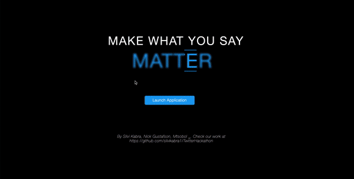

# Tweets to Stocks Hackathon Project
Created a simple web application using the Twitter API that displays highly recepted tweets from top CEOs and the stock market change over the following week for their respective companies, trying to show a correlation between the two.

# Demo

